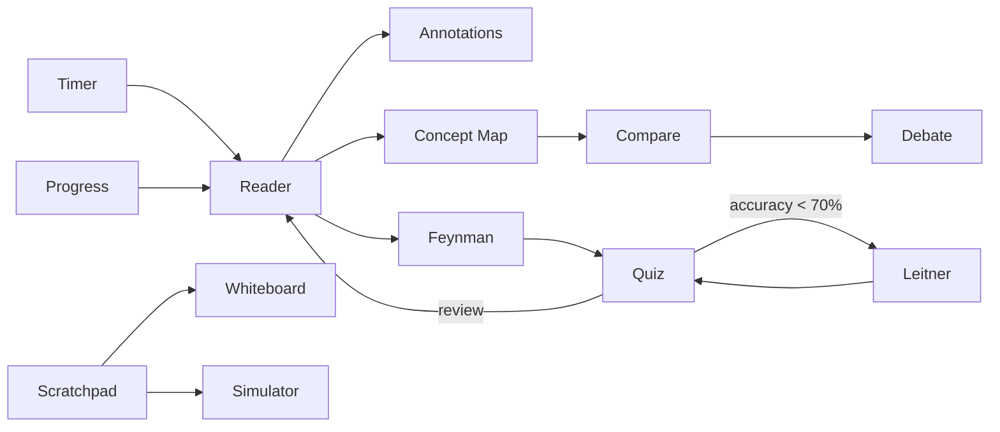

# Study Workspace — Exhaustive Tool Upgrade Spec (13 εργαλεία)

> **Σκοπός:** Πλήρης, υπερ-λεπτομερής κατάσταση και σχεδιασμός για κάθε εργαλείο του Study Workspace,
> ξεχωριστά και σε διασύνδεση. Συμπληρωματικό προς `workspaceToolCrossLinks.ts`, `WORKSPACE_UPGRADE_PLAN.md`, `FUNCTION_CATALOG.md`.
>
> **Pipeline:** `CONTENT_PIPELINE_VERSION = 2.5.x` · **Tests baseline:** 696+ unit test files · **i18n:** ~68% (see `I18N.md`)

---

## Διασύνδεση εργαλείων (Cross-tool graph)

Κάθε εργαλείο εκθέτει:
- **Cross-link bar** (`WorkspaceToolCrossLinkBar`) — Πηγή / Agent / related chips
- **Concept Bus signals** — `read`, `annotated`, `mapped`, `explained`, `simulated`, `quiz-correct/wrong`, `leitner-easy/hard`, `noted`, `focus`
- **Agent handoff** — `openAgentForSection` + `buildAgentContextForStep` + `autoSend: true`

| Από → Προς | Τρόπος | Signal |
|------------|--------|--------|
| Reader → Quiz | Cross-link «Test» / section chip Study | `focus` |
| Reader → Annotations | Highlight selection | `annotated` |
| Reader → Feynman | Cross-link / section Ask Agent | `explained` |
| Quiz → Leitner | Completion CTA (<70% accuracy) | `focus` |
| Quiz → Reader | Completion «Review source» | `read` |
| Leitner → Quiz | Header chip «Κουίζ» | `focus` |
| Scratchpad → Whiteboard | Export formula | `noted` |
| Scratchpad → Agent | «Explain formula» button | — |
| Concept Map → Reader | Node click | `read` / `mapped` |
| Feynman → Reader | Gap term jump | `read` |
| Debate → Reader | Claim excerpt | `read` |
| Compare → Reader | Row focus | `read` |
| Lesson rail ↔ Reader | Bidirectional sync (`readerStepSyncBridge`) | — |

---

## 1. Reader (Ανάγνωση)

### Τρέχουσα κατάσταση ✅
- Structured segments: headings, tables, math (KaTeX), bibliography blocks
- Section nav chips με **active segment** sync από lesson rail (`readerStepSegmentIndex`)
- **Bidirectional sync:** chip click → `handleReaderSectionNavSelect` → `selectWorkspaceStep(..., { focusReader: true })`
- Section action bar: Study / Ask Agent per section
- Selection bar: Ask Agent με excerpt (≤600 chars)
- OCR overlay + **OcrCorrectionPanel** (editable line repair MVP)
- Bionic / dyslexia / focus modes, paragraph TTS + scroll-follow (`readerTts.ts`)
- **Glossary popover:** click underlined term; **Define** (primary) + **Find in text** (Wave B)
- Bilingual side-by-side + paragraph-aligned sync scroll
- Full-source toggle, translation (glossary + optional LLM)
- Low source-quality banner (<50) στο workspace + CourseView

### Αρχεία
`CognitiveReader.tsx`, `readerDocumentLayout.ts`, `readerStepSync.ts`, `readerStepSyncBridge.ts`, `readerOcrCorrectionStore.ts`, `SourceQualityBanner.tsx`

### Tests
- `readerStepSync.test.ts` — lib mapping
- `readerStepSyncBridge.test.ts` — component-level integration (round-trip, quiz no-focus)
- `readerStepSyncP104QA.test.ts` — SW-P1-04 QA spine
- `utf8MojibakeRepair.test.ts` — mojibake repair (`έΑΦ` → em dash, etc.)
- `WorkspaceMobileToolDrawer.test.tsx` — SW-P1-02 mobile drawer
- `readerGreekSyllabus.test.ts`, `readerBilingualSync.test.ts`, κ.ά.

### Κενά / επόμενο
- [ ] Reprocess/re-upload για παλιά PPTX/PDF (garbled Greek pre-2.4) — runtime `greekTextRepair` + `utf8MojibakeRepair` mitigate display; source reprocess still recommended
- [x] Component DOM tests — partial: `WorkspaceMobileToolDrawer.test.tsx` (`@testing-library/react`)
- [ ] Inline glossary popover on **hover** (click + Define popover shipped Wave B)

---

## 2. Annotations (Επισημάνσεις)

### Τρέχουσα κατάσταση ✅
- Margin panel, term tags, focus-term highlight
- MD/JSON export, reader deep-links (`onOpenInReader`)
- Shared teacher annotations (fetch + publish when proxy configured)
- Realtime sync: SSE stream + poll fallback + `BroadcastChannel` + live badge
- **Sub-line span highlights** — select text within a line (`charStart`/`charEnd` on `StoredAnnotation`)
- **Agent handoff:** selected/highlighted text → auto-send prompt με section context

### Αρχεία
`AnnotationOverlay.tsx`, `annotationStore.ts`, `annotationSpan.ts`, `readerAnnotationStore.ts`, `annotationRealtimeSync.ts`

### Concept Bus
`annotated` on highlight · `read` on jump to reader

### Κενά
- [ ] Conflict resolution UI for concurrent edits
- [ ] OCR-corrected span re-anchor after reprocess

---

## 3. Scratchpad (Τύποι / Σημειώσεις)

### Τρέχουσα κατάσταση ✅
- Formula list από `noteBundle.formulas`
- Variable solver, step-by-step, optional CAS graph plot
- Export to Whiteboard (`sendScratchpadToWhiteboard`)
- **Agent:** «Explain formula step by step» με `openAgentForSection` + auto-send

### Αρχεία
`FormulaScratchpad.tsx`, `formulaSolver.ts`, `scratchpadGraph.ts`

### Cross-links
→ Whiteboard, Simulator, Reader (Source chip)

### Κενά
- [ ] SymPy-backed symbolic simplification (offline)
- [ ] Unit/dimension checker

---

## 4. Concept Map (Χάρτης εννοιών)

### Τρέχουσα κατάσταση ✅
- Force-directed layout + hierarchical layers (prerequisite depth filter)
- Mastery coloring, drag, zoom, PNG export
- **Editing (Wave B):** add / rename / delete node; connect edges; **delete edge**; **cycle relation** (prerequisite → related → contrasts); **undo** (30 snapshots)
- **Persistence:** full graph (nodes + edges) scoped per task via `conceptMapGraph.ts` + `workspacePersistence.ts`
- Node click → Reader (`onOpenInReader`) + Concept Bus `mapped`
- Cross-link bar → Feynman, Compare, Leitner
- Collaborative cursor sync (SSE) when proxy + course configured

### Αρχεία
`DraggableConceptMap.tsx`, `conceptMapGraph.ts`, `conceptMapForceLayout.ts`, `conceptMapHierarchy.ts`, `workspacePersistence.ts`

### Κενά
- [ ] Redo stack (undo only; no redo)
- [ ] Edge labels from co-occurrence PMI scores
- [ ] Keyboard a11y + screen-reader tree for canvas
- [ ] CRDT multi-user graph editing

---

## 5. Feynman (Απλή εξήγηση)

### Τρέχουσα κατάσταση ✅
- Rubric: accuracy, completeness, simplicity, structure
- Gap detection → reader span jump (`onOpenInReader`)
- Voice input, optional LLM coach
- HTML/PDF rubric export
- Glossary + reference notes grounding

### Cross-links
→ Reader, Concept Map, Quiz

### Κενά
- [ ] Dedicated «Open Quiz» chip post-rubric (currently via cross-link bar)
- [ ] Agent auto-send from weakest dimension hint

---

## 6. Compare (Σύγκριση)

### Τρέχουσα κατάσταση ✅
- Rows από tables + glossary dimensions
- Focus-term column priority (`workspaceCorrelation`)
- **Sortable columns**, **diff mode**, **CSV export** (Wave 7 / W8)
- Row click → Reader search

### Αρχεία
`CompareTable.tsx`, `compareDiff.ts`, `compareSort.ts`, `compareExport.ts`

### Κενά
- [ ] Visual diff highlighting between cells
- [ ] Agent: «Explain difference between X and Y»

---

## 7. Debate (Συζήτηση / Argument Map)

### Τρέχουσα κατάσταση ✅
- Tree: claims, support, rebuttals grounded on `readerText`
- Counter-argument suggestions from source
- Claim → Reader excerpt (`onOpenInReader`)

### Αρχεία
`ArgumentMap.tsx`, `debateRebuttalGraph.ts`, `debateCounterArgs.ts`

### Κενά
- [ ] User-added rebuttal nodes (persisted)
- [ ] Agent: Socratic challenge on selected claim

---

## 8. Quiz (Κουίζ)

### Τρέχουσα κατάσταση ✅
- Session flow: confidence rating, IRT display, local persistence
- Items από glossary + source sentences
- **Post-session CTAs:** Flashcards (<70%) · Review source
- Concept Bus: `quiz-correct` / `quiz-wrong`
- Cross-link → Leitner, Reader, Feynman

### Αρχεία
`WorkspaceQuizSession.tsx`, `WorkspaceQuiz.tsx`, `quizSession.ts`, `quizIrt.ts`

### Κενά
- [ ] Open Feynman on wrong answer cluster
- [ ] Server-side attempt history

---

## 9. Flashcards / Leitner (Κάρτες επανάληψης)

### Τρέχουσα κατάσταση ✅
- FSRS ratings (Again/Hard/Good/Easy), keyboard 1–4
- Deck sync + due heatmap, Anki export
- **Header chip → Quiz** (`onOpenQuiz`)
- Concept Bus: `leitner-easy` / `leitner-hard`
- **Card types** — `term` / `definition` / `cloze` / `formula` / `mistake` with
  auto-inference, EN+EL badges, type filter chips (`leitnerCardTypes.ts`)
- Quiz wrong-answer remediation → `mistake` cards (`quizRemediation.ts`)

### Αρχεία
`LeitnerBox.tsx`, `LeitnerPanel.tsx`, `leitnerCardTypes.ts`, `leitnerDeckSync.ts`,
`leitnerDueHeatmap.ts`, `ankiExport.ts`

### Κενά
- [ ] Cross-device deck sync via server

---

## 10. Simulator (Προσομοίωση)

### Τρέχουσα κατάσταση ✅
- Numeric/econ cues από notes (`sandboxSensitivity`)
- Sliders, sensitivity hints
- Concept Bus: `simulated`

### Cross-links
→ Scratchpad, Whiteboard, Quiz

### Κενά
- [ ] Course-specific preset scenarios
- [ ] Graph output export to Whiteboard

---

## 11. Whiteboard (Πίνακας)

### Τρέχουσα κατάσταση ✅
- Layers v2 (`WhiteboardDocument`), scratchpad import
- KaTeX stamps, reference excerpt sidebar
- Concept Bus: `noted` on engage
- **PNG + SVG export** (`whiteboardExport.ts`)

### Αρχεία
`StudyWhiteboard.tsx`, `whiteboardLayers.ts`, `whiteboardLatexStamps.ts`, `whiteboardExport.ts`

### Κενά
- [ ] Agent: explain diagram in natural language

---

## 12. Timer (Χρονόμετρο)

### Τρέχουσα κατάσταση ✅
- Pomodoro + exam countdown
- Bound to concept + step label + `scopeKey`
- Session complete → study minutes log
- Calendar .ics export

### Αρχεία
`StudyTimer.tsx`, `timerCalendarSync.ts`

### Κενά
- [ ] Auto-suggest break tool (Leitner during break)
- [ ] Weak-area weighted session targets

---

## 13. Progress / Dashboard (Πρόοδος)

### Τρέχουσα κατάσταση ✅
- Readiness ring, streak, reviews due, weak spots
- Next actions από tasks + concept bus insights
- Study time today/week + 7-day mini chart
- **NEW: Session tool activity breakdown** (`buildToolActivityBreakdown` → MiniDashboard chips)
- Weak spot click → `focusWeakArea` (Reader + step sync)

### Αρχεία
`MiniDashboard.tsx`, `workspaceData.ts`, `conceptBusPanelModel.ts`, `workspaceWeakAreas.ts`

### Κενά
- [ ] Per-tool time-on-tool (requires engagement timestamps)
- [ ] Export progress report PDF

---

## Next wave (ολοκληρωμένα / σε εξέλιξη)

| Item | Status | Files |
|------|--------|-------|
| Regenerate tasks after reprocess | ✅ | `pipelineReprocess.ts`, `useStore.reprocessCourseMaterial`, `pipelineReprocess.test.ts` |
| CourseView low-quality banner | ✅ | `SourceQualityBanner` in `CourseView.tsx` |
| Reader↔step sync component tests | ✅ | `readerStepSyncBridge.test.ts`, `readerStepSyncP104QA.test.ts` |
| Mobile tool drawer (SW-P1-02) | ✅ | `WorkspaceMobileToolDrawer.tsx`, `WorkspaceMobileToolDrawer.test.tsx` |
| UTF-8 mojibake repair + Noto Greek typography | ✅ | `utf8MojibakeRepair.ts`, `index.html`, `.reader-prose` |
| LessonStepToolBar ↔ nextAction (SW-07) | ✅ | `lessonStepToolbarNextActionSync.ts` |
| Cross-link bar all tools | ✅ | `WorkspaceToolCrossLinkBar`, `workspaceToolCrossLinks.ts` |
| Quiz ↔ Leitner ↔ Reader wiring | ✅ | `WorkspaceQuizSession`, `LeitnerBox`, `StudyWorkspace` |
| Scratchpad / Annotations Agent | ✅ | `FormulaScratchpad`, `AnnotationOverlay` |
| Progress tool activity | ✅ | `conceptBusPanelModel.buildToolActivityBreakdown` |

### Επόμενα (backlog)
- [ ] Glossary refresh on reprocess (currently topics + tasks only)
- [ ] Feynman / Compare / Debate dedicated Agent chips (beyond cross-link bar)
- [x] E2E: Reader section nav → step rail sync — `reader-step-sync.spec.ts` (2 cases)
- [ ] `@testing-library/react` — expand beyond mobile drawer test

---

## Learning flow (προτεινόμενη ακολουθία)



---

## Έλεγχος ποιότητας

```bash
npm run typecheck
npm test
```

Hard refresh (`Ctrl+Shift+R`) μετά από HMR issues. Για garbled Greek Reader: **Reprocess** ή re-upload (pipeline ≥ 2.4.0). Runtime mojibake (`έΑΦ` κ.λπ.) mitigated by `utf8MojibakeRepair` — reprocess still fixes source text.

---

*Τελευταία ενημέρωση: κύμα exhaustive tool upgrade — wiring, cross-links, Progress breakdown, reprocess task regen, component-level Reader sync tests.*
