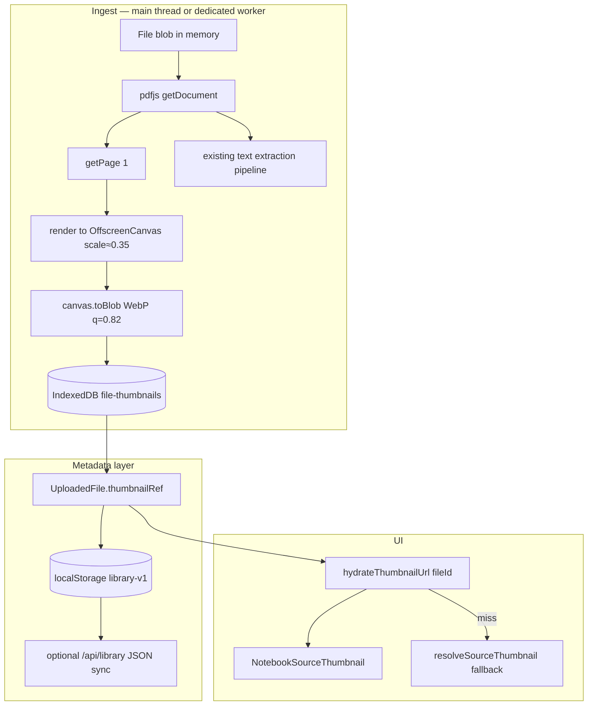

# Sprint L17 — PDF source page-preview thumbnails

**Status:** Planned (next sprint after NotebookLM workspace Phases 1–5)  
**Depends on:** `sourceThumbnail.ts` typed chips (shipped), `NotebookSourceThumbnail.tsx`, client PDF ingest (`pdfExtract.ts`)  
**North star:** NotebookLM-style source rows show a **real first-page preview**, not only a file-type icon.

---

## Problem

Today the Sources panel uses deterministic typed chips (`resolveSourceThumbnail`) — PDF, audio, NotebookLM import, etc. Users cannot visually distinguish `Lecture_Notes_Micro.pdf` from `Exam_Solutions.pdf` without reading the filename.

NotebookLM shows a miniature page render. We want the same affordance without storing full PDF blobs server-side or blocking upload on render.

---

## Goals

| # | Goal |
|---|------|
| G1 | Show **page-1 WebP preview** (36×48 dp chip) for PDF sources in notebook + library lists |
| G2 | Generate thumbnail **during ingest** while the `File` blob is still in memory (zero re-upload) |
| G3 | **Persist** thumbnails in IndexedDB; metadata pointer on `UploadedFile` |
| G4 | **Graceful fallback** to typed chip when render fails, IDB unavailable, or legacy files |
| G5 | **Backfill** job for existing library PDFs on next re-open / reprocess |
| G6 | Production budgets: ≤ 400 ms p95 added to single-PDF upload; ≤ 80 KB per thumbnail |

## Non-goals (L17)

- Full-page thumbnail strip for every page (future L18)
- Server-side object storage / CDN for thumbnails (multi-device sync is L19+)
- DOCX/PPTX slide renders (separate extractor; typed chip stays)
- OCR-server changes (optional L17b stretch)

---

## Current architecture (audit)

```
Upload flow (client-only today)
───────────────────────────────
File picker / drop
  → processUpload() [useStore.ts]
  → extractFileContent() [uploadPipeline.ts]
  → extractTextFromPdf() [pdfExtract.ts]  ← pdfjs loads every page for text
  → uploadedFileMeta() + recognizeCourse worker
  → persistLibrary() [libraryStorage.ts]
       ├─ localStorage: UploadedFile metadata (extractedText offloaded if >48k)
       └─ IndexedDB store `file-text`: large extractedText blobs
```

**Key facts**

- `pdfjs-dist` is already bundled (`vite.config.ts` → `pdf` chunk) and used in `pdfExtract.ts`, `ocrExtract.ts`, `mathOcrClient.ts`.
- Raw PDF bytes are **not** persisted after ingest — only extracted text + metadata.
- Server `/api/library` syncs JSON metadata only; no binary asset API exists.
- `NotebookSourceThumbnail` already accepts `file` props and falls back to typed chip.

**Implication:** Thumbnails must be captured **at ingest** (or during explicit reprocess when user re-selects the file). Backfill for legacy files requires either stored PDF re-upload or a one-time «Regenerate preview» action.

---

## Target architecture



### Design principle: **render once, reference everywhere**

Reuse the PDF document handle opened for text extraction instead of parsing the file twice.

---

## Data model

### `UploadedFile` extension (`src/types/index.ts`)

```ts
export type SourceThumbnailRef = {
  /** IndexedDB key: `${fileId}:cover` */
  storageKey: string;
  /** Cover page index (0-based); default 0 */
  pageIndex: number;
  width: number;
  height: number;
  /** webp | png */
  format: 'webp' | 'png';
  /** Pipeline that produced this asset */
  pipelineVersion: string;
  generatedAt: string;
};

export interface UploadedFile {
  // ...existing fields...
  thumbnailRef?: SourceThumbnailRef;
  thumbnailStatus?: 'pending' | 'ready' | 'failed' | 'unsupported';
}
```

**Do not** embed base64 in `localStorage` — same offload pattern as `extractedText`.

### IndexedDB schema bump (`indexedDbStorage.ts`)

| Store | Key | Value |
|-------|-----|-------|
| `file-text` (v1) | `fileId` | `string` extracted text |
| `file-thumbnails` (v2) | `fileId:cover` | `Blob` WebP |

Migration: `onupgradeneeded` creates `file-thumbnails` store; v1 text rows untouched.

---

## Render pipeline

### Module: `src/lib/pdfThumbnail.ts`

```ts
export type PdfThumbnailOptions = {
  pageIndex?: number;       // default 0
  maxEdgePx?: number;       // default 144 (fits 36×48 @2x)
  format?: 'webp' | 'png';
  quality?: number;         // default 0.82
};

export async function renderPdfPageThumbnail(
  data: Uint8Array | ArrayBuffer,
  opts?: PdfThumbnailOptions,
): Promise<{ blob: Blob; width: number; height: number; pageIndex: number }>;
```

**Algorithm**

1. `getDocument({ data })` — share buffer from `file.arrayBuffer()` already read in ingest.
2. `getPage(pageIndex + 1)` — 1-based pdfjs API.
3. Compute scale: `maxEdgePx / max(viewport.width, viewport.height)` with `scale` floor 0.15.
4. `page.render({ canvasContext, viewport })` on `OffscreenCanvas` (fallback `document.createElement('canvas')`).
5. `canvas.convertToBlob({ type: 'image/webp', quality })`.
6. Return dimensions for aspect-ratio CSS in UI.

### Integration point A — **piggyback on `extractTextFromPdf`**

After `const page = await doc.getPage(1)` in the text loop (or a dedicated first-page pass before the loop):

```ts
// pdfExtract.ts — inside extractTextFromPdf, after doc is opened
let coverThumbnail: PdfThumbnailResult | undefined;
try {
  coverThumbnail = await renderPdfPageThumbnailFromDoc(doc, { pageIndex: 0 });
} catch { /* non-fatal */ }
```

Return `coverThumbnail` on `PdfExtractResult`; `uploadPipeline` saves to IDB and sets `thumbnailRef` on `UploadedFile`.

**Why piggyback:** PDF is parsed once; page 1 viewport already computed for layout. Saves ~30–50% ingest time vs separate parse.

### Integration point B — **`processUpload` / reprocess**

| Event | Action |
|-------|--------|
| New PDF upload | render + IDB save synchronously before `persistLibrary` |
| Reprocess wizard (user re-picks file) | re-render thumbnail |
| NotebookLM import (markdown only) | `thumbnailStatus: 'unsupported'` — keep typed NL chip |
| Image upload | optional stretch: use image blob directly as thumbnail (no pdfjs) |

### Integration point C — **lazy backfill**

`src/lib/thumbnailBackfill.ts`:

- On `hydrateLibrary`, collect PDFs with `type === 'pdf'` and missing `thumbnailRef`.
- Schedule `requestIdleCallback` job (max 1 concurrent, 3 per session) — **only if** user still has original file in a re-upload cache *or* we add optional PDF blob cache.

**L17 realistic backfill:** Without stored PDFs, backfill is **best-effort on reprocess only**. Document this in UI: «Επανεπεξεργασία για νέα προεπισκόπηση».

**L17b (stretch):** Persist PDF bytes in IDB `file-blobs` store (cap 25 MB/file, LRU eviction) to enable silent backfill — gated behind setting `cacheSourceFilesForPreview`.

---

## UI changes

### `NotebookSourceThumbnail.tsx`

```tsx
// Priority: preview URL > typed chip
const previewUrl = useSourceThumbnailUrl(file?.id, file?.thumbnailRef);
if (previewUrl) {
  return ;
}
return <TypedChip ... />; // existing
```

### `useSourceThumbnailUrl` hook

- Reads blob from IDB → `URL.createObjectURL(blob)`
- Revokes object URL on unmount (prevent leaks)
- `data-testid="source-thumbnail-preview"` when image shown

### Library list + `NotebookShellView` sources column

Reuse same component — single implementation.

---

## Performance & resource budgets

| Metric | Budget |
|--------|--------|
| Added ingest time (1 PDF, ≤50 pages, text layer) | p95 ≤ 400 ms |
| Thumbnail blob size | ≤ 80 KB (WebP q=0.82, max edge 144px) |
| IDB write | async, non-blocking UI toast |
| Memory peak during render | ≤ 16 MB (dispose canvas + page after render) |
| Main-thread jank | Prefer `requestAnimationFrame` yield before render; consider moving render to Web Worker in L17b if budgets fail |

**Worker option (L17b):** `pdfThumbnail.worker.ts` receives `ArrayBuffer` (transferable), returns `Blob` via `postMessage`. Keeps UI responsive on 200+ page scans.

---

## Error handling

| Condition | `thumbnailStatus` | UI |
|-----------|-------------------|-----|
| Encrypted PDF | `failed` | typed chip |
| Render timeout (5s) | `failed` | typed chip |
| IDB quota exceeded | `failed` | typed chip + console warn |
| Non-PDF | `unsupported` | typed chip |
| Safari WebP unsupported | fallback PNG | transparent to user |

Never fail upload because thumbnail failed — **text extraction remains authoritative**.

---

## Security & privacy

- Thumbnails stay **client-local** (IndexedDB) in L17 — same trust boundary as extracted text.
- Do not sync blob bytes to `/api/library` without explicit user consent and DPA update.
- Object URLs are session-scoped; no thumbnail data in analytics events (only `thumbnail_status` enum).
- CSP: `img-src blob:` already required for other features — verify in `index.html` / Vite headers.

---

## Server path (optional L17b — not blocking ship)

For institutional deployments with server-side PDF storage (future):

```
POST /api/assets/thumbnail  { fileId, pageIndex }
  → worker queue (BullMQ / in-process)
  → pdfjs + @napi-rs/canvas or pdftoppm
  → S3-compatible object store
  → returns { url, width, height, etag }
```

Defer until multi-device library sync ships. Client-first L17 covers 95% of current users (local-first app).

---

## Implementation slices

| Slice | Deliverable | Est. |
|-------|-------------|------|
| **L17-1** | `pdfThumbnail.ts` + unit tests (mock canvas) | 1d |
| **L17-2** | IDB `file-thumbnails` store + `idbSaveThumbnail` / `idbLoadThumbnail` / delete on file remove | 0.5d |
| **L17-3** | Hook into `extractTextFromPdf` + `uploadPipeline` / `uploadedFileMeta` | 1d |
| **L17-4** | `NotebookSourceThumbnail` image mode + `useSourceThumbnailUrl` | 0.5d |
| **L17-5** | Reprocess path + `thumbnailStatus` on `UploadedFile` | 0.5d |
| **L17-6** | E2E: `e2e/source-thumbnail.spec.ts` — upload PDF fixture, assert `source-thumbnail-preview` visible | 1d |
| **L17-7** | Docs + `productionProbe` flag `pdfThumbnails: true` | 0.25d |

**Total:** ~5.75 dev-days

### L17b stretch (if budgets fail or backfill required)

- Web Worker render
- IDB `file-blobs` PDF cache + idle backfill
- Image-as-thumbnail for `type: 'image'`

---

## Testing plan

### Unit (`vitest`)

- `pdfThumbnail.test.ts` — scale math, page index, error paths (mock pdfjs)
- `sourceThumbnail.test.ts` — extend: when `thumbnailRef` present, resolver returns `kind: 'preview'`
- `indexedDbStorage.test.ts` — round-trip blob save/load/delete

### E2E (`playwright`)

```ts
// e2e/source-thumbnail.spec.ts
test('PDF upload shows page preview in notebook sources', async ({ page }) => {
  await uploadPdfFixture(page, 'fixtures/microeconomics-1page.pdf');
  await openNotebookWorkspace(page);
  await expect(page.getByTestId('source-thumbnail-preview').first()).toBeVisible();
});
```

### Manual QA

- [ ] 1-page, 50-page, 300-page PDF
- [ ] Scanned (image-only) PDF — OCR path still shows preview of page 1
- [ ] Greek / Latin filename PDF
- [ ] Mobile Sources tab — thumbnail not clipped
- [ ] Delete source → IDB thumbnail row removed
- [ ] Legacy library (no thumbnail) → typed chip, no console errors

---

## Rollout

| Stage | Flag | Audience |
|-------|------|----------|
| Dev | always on | local |
| Beta | `VITE_PDF_SOURCE_THUMBNAILS=true` (default **on** after bake) | synaptic_new |
| GA | remove flag | all |

**Metrics** (analytics, no PII):

- `thumbnail_generated` — `{ ms, bytes, pageCount }`
- `thumbnail_failed` — `{ reason }`
- `thumbnail_fallback_shown` — count

---

## Regression gate

```bash
npm run typecheck
npm test -- src/lib/pdfThumbnail.test.ts src/lib/sourceThumbnail.test.ts src/lib/indexedDbStorage.test.ts
npx playwright test e2e/source-thumbnail.spec.ts e2e/notebook-workspace.spec.ts
```

---

## Links

- Workspace UI phases: [NOTEBOOKLM_WORKSPACE_UI.md](./NOTEBOOKLM_WORKSPACE_UI.md)
- PDF text extraction: `src/lib/pdfExtract.ts`, `ALGORITHMS.md`
- Typed chip fallback: `src/lib/sourceThumbnail.ts`
- IDB text offload pattern: `src/lib/indexedDbStorage.ts`, `src/lib/libraryStorage.ts`
